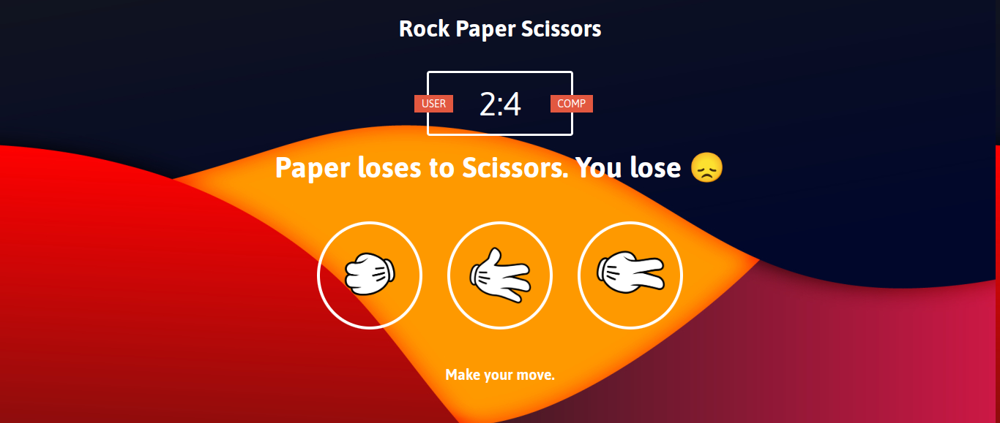

# THE ODIN PROJECT ROCK PAPER SCISSOR

 - I created this game within 2 days to improve by skills especially in DOM Manipulation

## Table of contents

- [Overview](#overview)
  - [The challenge](#the-challenge)
  - [Screenshot](#screenshot)
  - [Links](#links)
  - [Built with](#built-with)
  - [What I learned](#what-i-learned)
  - [Useful resources](#useful-resources)
- [Acknowledgments](#acknowledgments)


## Overview
We’re going to make a simple implementation of grade-school classic “rock paper scissors”. If you don’t know what that is check the Wikipedia article or this ridiculous step-by-step.

### The challenge

Users should be able to implement a game that will against to Computer

### Screenshot




### Links

- Solution URL:(https://github.com/troy03/rock-paper-scissors)
- Live Site URL:(https://troy03.github.io/rock-paper-scissors/)

### Built with

- Semantic HTML5 markup
- CSS custom properties
- Vanilla JavaScript

### What I learned

You can add a class or id that cannot implement in HTML that can manipulate by JavaScript. I'm getting amazed that you can random select not only a number but a word. 

```js
function getComputerChoice() {
    const choices = ['r', 'p', 's' ];
    const randomNumber = Math.floor(Math.random() * 3);
    return choices[randomNumber];
}
```
If you want more help with writing markdown, we'd recommend checking out [The Markdown Guide](https://www.markdownguide.org/) to learn more.

### Useful resources

- (https://www.youtube.com/watch?v=jaVNP3nIAv0&t=4507s) - This was my inspiration to build my project and a big help to me and learn the term of caching the DOM that can speed up the workflow.

## Acknowledgments

Special thanks to the community of The Odin Project in discord for helping me to solve an error and guide to what actually not to do.
